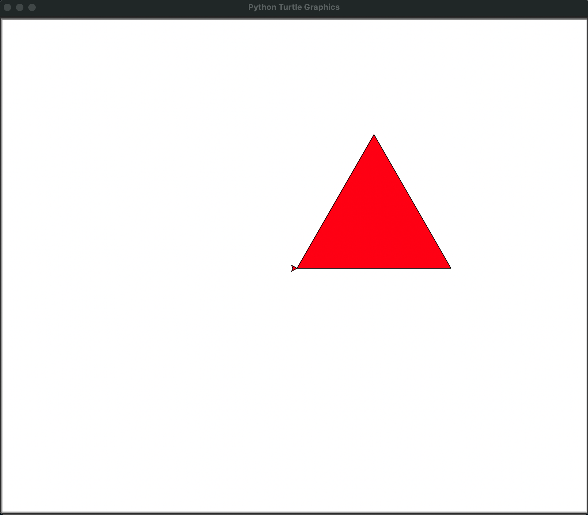
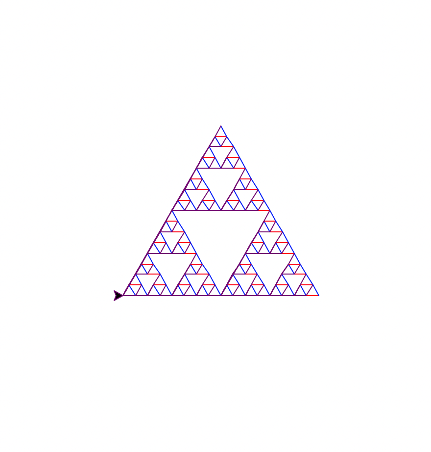
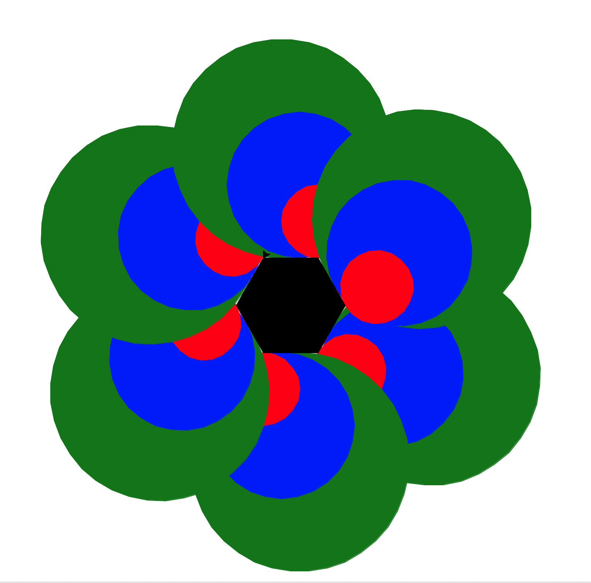

# Lab 5

For this week's lab we are going to make some basic art in python  using the `turtle` library. You can install `turtle` with:
```bash
pip install turtle
```

The objective of this assignment will be to make **two designs or graphics** using turtle and print them on a canvas created by the turtle library when called upon. Try creating a basic shape first:
```python
import turtle 
  
# creating turtle pen 
t = turtle.Turtle() 
  
  
# set the fillcolor 
t.fillcolor('red') 
  
# start the filling color 
t.begin_fill() 
s = 250
# drawing the triangle of side s 
for _ in range(3): 
  t.forward(s) 
  t.right(-120) 
  
# ending the filling of the color 
t.end_fill() 
turtle.done()

```
Which produces a canvas with a triangle:


Once you can create a shape, the task will be to write two python scripts utilizing turtle to create some symmetric geometric patterns (or non-symmetric if it ends up looking cool and you successfully automate generating mulitple shapes). But you will need to use Python to dynamically generate graphics with the following requirements.
**Make sure you create and submit two python files with two different turtle graphics.**

## Graphic Requirements
1. Each turtle graphic shall have at least two types of shapes
2. Each turtle graphic should have at least 4 shapes total (of two types or more)
3. Each turtle graphic should use at least three different colors  (white background doesn't count as a color).
4. Use at least one loop (for/while) to dynamically generate shapes
5. In either of your graphic scripts, have at least one filled shape, please try to use a color other than the standard black.

Submit two Python files in your Brightspace submission with the following convention:
`lastname_firstname_lab5-1.py`
`lastname_firstname__lab5-2.py`


### Documentation and example code to work from
I have provided two python scripts with example turtle graphics you can work from, `example_lab5.py` and `example_2_lab5.py`. You are welcome to use these as a starting point for your lab, but make sure you change up the shapes and colors used, I am looking for creativity and ability to read through the documentation and find new things! Here are some other articles and documentation you can look through to find examples of how to make turtle-graphics:

#### Links
1. [Turtle Docs](https://docs.python.org/3/library/turtle.html#module-turtle)
1. [G4G, creating basic filled shapes](https://www.geeksforgeeks.org/draw-color-filled-shapes-in-turtle-python/)
1. [Fibonacci pattern with Turtle](https://www.geeksforgeeks.org/python-plotting-fibonacci-spiral-fractal-using-turtle/)


#### Example outputs
When you run either example turtle script, this is what the graphics should look like.



#### [Some favorite renders from previous semesters](favorite-designs/)
